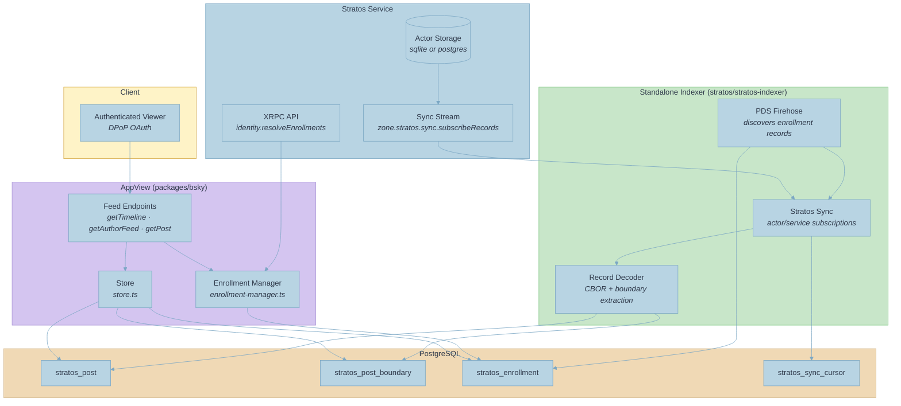
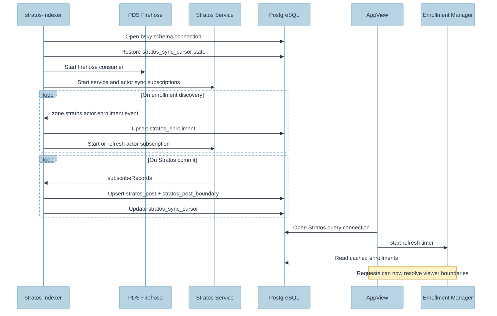

# Stratos Integration

This fork consumes Stratos data on the query side. It does not perform Stratos commit ingestion inside the AppView process.

The current architecture is split across repositories:

- `stratos/stratos-indexer` ingests PDS and Stratos sync events and writes `stratos_*` tables.
- `atproto-stratos/packages/bsky` reads those tables and exposes `zone.stratos.feed.*` endpoints.
- `StratosEnrollmentManager` in this repo refreshes viewer enrollment state from the Stratos service when the AppView needs boundary data.

## Runtime Components In This Repo

| Component | File | Purpose |
| --- | --- | --- |
| Enrollment manager | `packages/bsky/src/stratos/enrollment-manager.ts` | Cache and refresh viewer boundaries |
| Stratos store | `packages/bsky/src/stratos/store.ts` | Query indexed Stratos rows from Postgres |
| Feed handlers | `packages/bsky/src/api/zone/stratos/feed/*.ts` | Serve `getTimeline`, `getAuthorFeed`, and `getPost` |
| Auth verifier changes | `packages/bsky/src/auth-verifier.ts` | Accept DPoP-authenticated clients |

### Data Flow



## End-to-End Flow

```text
Stratos service + user PDS
  -> stratos-indexer
  -> PostgreSQL (`stratos_post`, `stratos_post_boundary`, `stratos_enrollment`, `stratos_sync_cursor`)
  -> AppView store queries
  -> `zone.stratos.feed.*` endpoints
```

### Startup Sequence



## What Starts In-Process

When `STRATOS_SERVICE_URL`, `STRATOS_SERVICE_DID`, and `DB_URL` are set, this repo starts:

1. a Stratos-specific Kysely database connection,
2. `StratosStore`,
3. `StratosEnrollmentManager`,
4. the `zone.stratos.feed.*` API routes.

It does not start a WebSocket sync worker.

## Enrollment Manager Behavior

`StratosEnrollmentManager` is responsible for turning a viewer DID into boundary values usable by the feed handlers.

Current behavior:

- check a short-lived in-memory cache,
- fall back to cached Postgres enrollment data,
- on cache miss, call `GET /xrpc/zone.stratos.identity.resolveEnrollments?did=<did>` on the configured Stratos service,
- upsert the returned boundaries into `stratos_enrollment`.

The manager can also refresh all known enrollments on a timer. In the current code it is started with a 5-minute refresh interval.

## Store Behavior

`StratosStore` provides the query surface consumed by the feed endpoints:

- `getTimeline({ viewerBoundaries, limit, cursor })`
- `getAuthorFeed({ actorDid, viewerBoundaries, boundary, limit, cursor })`
- `getPost(uri)`
- `getPostBoundaries(uri)`
- `getEnrollment(did)` and `getBoundaries(did)`

The store works only against already-indexed data. It does not subscribe to Stratos itself.

## Feed Endpoints

The AppView registers three Stratos endpoints:

| Endpoint | Behavior |
| --- | --- |
| `zone.stratos.feed.getTimeline` | Boundary-filtered cross-author timeline |
| `zone.stratos.feed.getAuthorFeed` | Boundary-filtered feed for a single author |
| `zone.stratos.feed.getPost` | Single-post lookup with boundary access check |

All three use the authenticated viewer DID to resolve boundaries through `ctx.stratosEnrollmentManager`.

## Database Tables

The AppView expects the following indexed tables to exist in Postgres:

| Table | Purpose |
| --- | --- |
| `stratos_post` | Indexed post content and sort keys |
| `stratos_post_boundary` | Boundary mapping per post URI |
| `stratos_enrollment` | Cached enrollment state per DID |
| `stratos_sync_cursor` | Cursor state written by the standalone indexer |

The ingestion path that maintains these tables lives in `stratos/stratos-indexer`, not here.

## Boundary Access Rule

A viewer can see a Stratos post only when there is at least one overlap between:

- the post's boundaries in `stratos_post_boundary`, and
- the viewer's boundaries from `stratos_enrollment` or the live Stratos lookup.

If the viewer has no boundaries, the timeline and author feed return empty results and `getPost` rejects access.

## Configuration

| Variable | Description |
| --- | --- |
| `STRATOS_SERVICE_URL` | Base URL of the Stratos service |
| `STRATOS_SERVICE_DID` | DID of the Stratos service |
| `DB_URL` | Postgres URL used for Stratos queries |
| `DB_SCHEMA` | Stratos table schema, defaults to `bsky` |
| `STRATOS_DB_POOL_SIZE` | Optional pool size for the Stratos query connection |

`STRATOS_SYNC_ENABLED` is still present in config, but the current AppView runtime does not use it to start an in-process Stratos subscriber.

## Related Files Outside This Repo

- `../stratos/stratos-indexer/src/indexer.ts`
- `../stratos/stratos-indexer/src/stratos-sync.ts`
- `../stratos/stratos-indexer/src/pds-firehose.ts`

## File Map

```
packages/bsky/src/
├── stratos/
│   ├── index.ts                 # Re-exports
│   ├── auth.ts                  # Service auth JWT creation
│   ├── enrollment-manager.ts    # Boundary cache + Stratos API client
│   ├── record-indexer.ts        # Shared row mapping helpers used by indexer-side code
│   └── store.ts                 # DB read operations for feeds
├── api/zone/stratos/feed/
│   ├── getTimeline.ts           # Timeline endpoint
│   ├── getAuthorFeed.ts         # Author feed endpoint
│   └── getPost.ts               # Single post endpoint
├── data-plane/server/db/
│   ├── migrations/
│   │   └── 20260312T...add-stratos-tables.ts
│   └── tables/
│       ├── stratos-post.ts
│       ├── stratos-post-boundary.ts
│       ├── stratos-enrollment.ts
│       └── stratos-sync-cursor.ts
├── auth-verifier.ts             # + DPoP verification
├── config.ts                    # + Stratos config values
├── context.ts                   # + Stratos service accessors
└── index.ts                     # + Stratos wiring at startup

packages/bsky/tests/stratos/
├── record-indexer.test.ts       # Record indexing unit tests
└── store.test.ts                # Store query unit tests

lexicons/zone/stratos/
├── defs.json
├── boundary/defs.json
└── feed/
    ├── post.json
    ├── getTimeline.json
    ├── getAuthorFeed.json
    └── getPost.json
```
