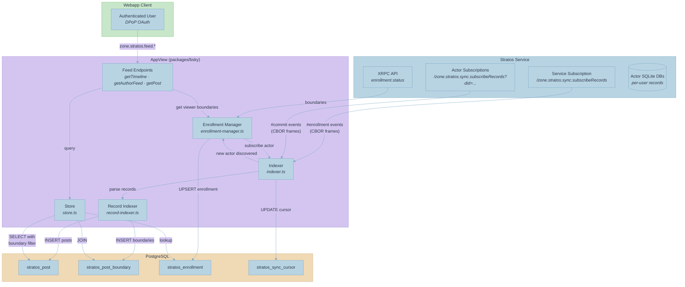
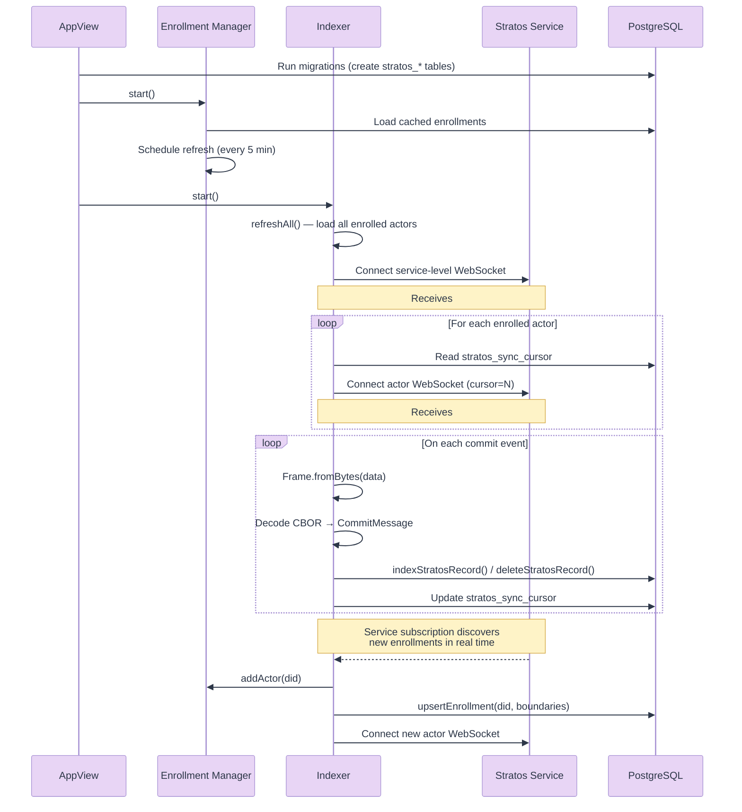
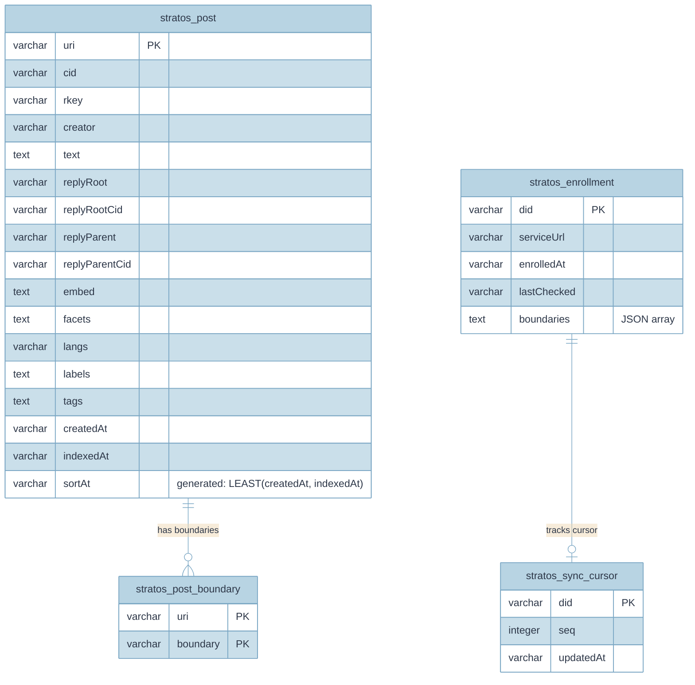
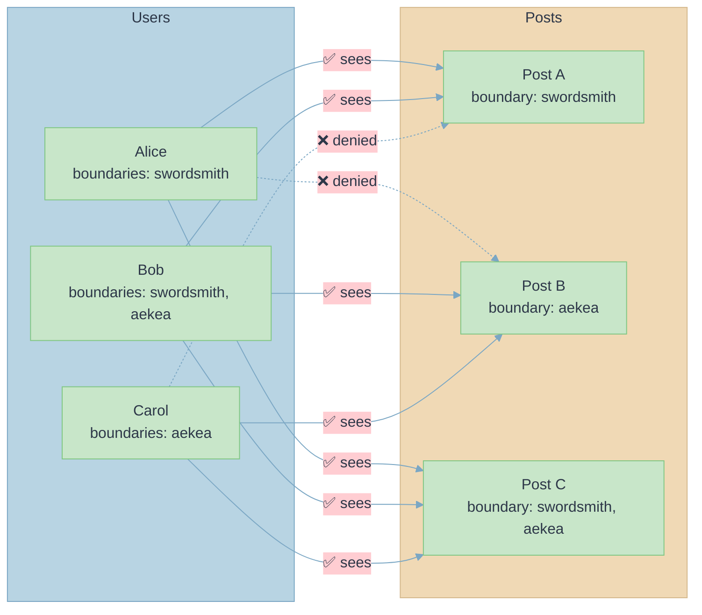

# Stratos Integration

The AppView integrates with [Stratos](../../stratos/), a private permissioned data service for ATProtocol. Stratos stores boundary-scoped records (posts visible only to users who share a boundary), and the AppView indexes and serves those records through `zone.stratos.feed.*` XRPC endpoints.

## How It Works

The integration has three runtime components that start when Stratos is configured:

1. **Enrollment Manager** — Discovers users enrolled with the Stratos service, fetches their boundaries, and periodically refreshes the enrollment cache.
2. **Indexer** — Connects to Stratos via WebSocket subscriptions, receives CBOR-encoded commit events in real time, and writes records to PostgreSQL.
3. **Feed Endpoints** — Three XRPC handlers that query the indexed records with boundary-based access control.

### Data Flow



### Startup Sequence



## Components

### Enrollment Manager (`enrollment-manager.ts`)

Manages the mapping between users and their Stratos boundaries. The feed endpoints need to know a viewer's boundaries to filter posts, and the indexer needs to know which actors are enrolled so it can subscribe to their streams.

**Key behaviors:**
- On start, loads all enrollments from `stratos_enrollment` into an in-memory cache
- Exposes `getBoundaries(did)` — returns cached boundaries, or fetches from Stratos on cache miss (lazy enrollment)
- Exposes `getEnrollment(did)` — returns the full enrollment record
- Refreshes all cached enrollments every 5 minutes by re-fetching boundaries from Stratos
- When a cache miss triggers a fetch, notifies the indexer via `ActorSubscriber.addActor(did)` so it starts a WebSocket subscription

**Boundary resolution flow:**
1. Check in-memory cache
2. On miss → call `zone.stratos.enrollment.status` on the Stratos service (authenticated with service-auth JWT)
3. Parse boundaries from response (`Array<{value: string}>` format)
4. Upsert to `stratos_enrollment` table and in-memory cache
5. Notify the indexer to subscribe to the actor's stream

### Indexer (`indexer.ts`)

Maintains WebSocket connections to the Stratos service and processes incoming events. There are two types of connections:

**Service-level subscription** — A single WebSocket to the Stratos `/xrpc/zone.stratos.sync.subscribeRecords` endpoint (no `did` parameter). Receives `#enrollment` messages when users enroll or update their boundaries. On receiving an enrollment event, the indexer calls `addActor()` on itself to start a per-actor subscription.

**Per-actor subscriptions** — One WebSocket per enrolled actor, connecting to `/xrpc/zone.stratos.sync.subscribeRecords?did={did}&cursor={seq}`. Receives `#commit` messages containing record operations (create, update, delete) for that actor's repository.

**CBOR frame decoding:**
Messages arrive as binary WebSocket frames in the AT Protocol XRPC subscription format:
```
[CBOR header][CBOR body]
```
The header contains `{ op: 1, t: 'zone.stratos.sync.subscribeRecords#commit' }` and the body contains the commit/enrollment payload. The indexer uses `Frame.fromBytes()` from `@atproto/xrpc-server` to decode these frames.

**Path handling:**
Stratos commit events include `ops[].path` in the format `/collection/rkey` (with a leading slash, matching `AtUri.pathname` behavior). The indexer strips the leading slash before extracting the collection name.

**Reconnection:**
Both service and actor WebSocket connections automatically reconnect on close/error with a 5-second backoff delay. Cursors are persisted in `stratos_sync_cursor` so reconnections resume from the last processed event.

### Record Indexer (`record-indexer.ts`)

Pure database operations for writing and deleting indexed Stratos records. Called by the indexer when processing commit events.

**`indexStratosRecord(db, uri, cid, record, indexedAt)`:**
1. Parses the `zone.stratos.feed.post` record to extract text, reply references, embeds, facets, langs, labels, and tags
2. Upserts into `stratos_post` (ON CONFLICT UPDATE)
3. Replaces all rows in `stratos_post_boundary` for the URI with the record's current boundaries

**`deleteStratosRecord(db, uri)`:**
1. Deletes from `stratos_post_boundary` WHERE uri = ?
2. Deletes from `stratos_post` WHERE uri = ?

### Store (`store.ts`)

Read-only query layer over the Stratos tables. Used by the feed endpoints.

**`getTimeline({ viewerBoundaries, limit, cursor })`:**
Returns posts visible to the viewer across all authors. Joins `stratos_post` with `stratos_post_boundary` WHERE boundary IN (viewer's boundaries), ordered by `sortAt` DESC. Supports cursor-based pagination.

**`getAuthorFeed({ actorDid, viewerBoundaries, boundary, limit, cursor })`:**
Same as getTimeline but filtered to a single author. Optional `boundary` parameter further restricts to a specific boundary.

**`getPost(uri)`:**
Returns a single post with its boundaries. The calling endpoint handles the boundary access check.

**`upsertEnrollment(did, serviceUrl, boundaries)`:**
Writes to `stratos_enrollment`. Stores boundaries as a JSON-stringified array.

**`getAllEnrollments()`:**
Returns all enrollments. Used by `refreshAll()` at indexer startup.

### Feed Endpoints

Three XRPC endpoints registered under `zone.stratos.feed.*`:

#### `getTimeline`
- **Auth:** `standard` (DPoP or Bearer)
- **Params:** `limit`, `cursor`, `boundary` (optional filter)
- **Flow:** Resolve viewer DID → get viewer boundaries → query store → return feed
- Returns empty feed if viewer has no boundaries (not enrolled)

#### `getAuthorFeed`
- **Auth:** `standard`
- **Params:** `actor` (DID or handle), `limit`, `cursor`, `boundary`
- **Flow:** Resolve actor handle to DID → get viewer boundaries → query store → return feed
- Returns empty feed if viewer has no boundaries

#### `getPost`
- **Auth:** `standard`
- **Params:** `uri` (AT URI)
- **Flow:** Fetch post → check viewer shares at least one boundary → return post or error
- Returns `BoundaryMismatch` error if viewer lacks access

### DPoP Authentication (`auth-verifier.ts`)

The webapp client authenticates directly with the AppView using DPoP-bound OAuth access tokens (bypassing the PDS proxy path). The auth verifier was extended to handle `DPoP` authorization scheme:

1. Extract the access token from `Authorization: DPoP <token>`
2. Decode the JWT payload (without signature verification — the token may be HS256 from PDS)
3. Validate expiry and extract `sub` (the user's DID) and `cnf.jkt` (DPoP key thumbprint)
4. Verify the `DPoP` proof header: validate `typ`, `htm`, `htu`, `ath` claims and confirm the JWK thumbprint matches `cnf.jkt`
5. Return credentials with the user's DID

This allows the webapp to call `zone.stratos.feed.*` endpoints directly without routing through a PDS.

### Service Auth (`auth.ts`)

The indexer authenticates to Stratos using inter-service JWTs:
```typescript
createStratosSyncToken(signingKey, appviewDid, stratosServiceDid)
```
Creates a short-lived JWT (60s TTL) signed by the AppView's keypair with `aud: stratosServiceDid` and `iss: appviewDid`. Passed as a `syncToken` query parameter on WebSocket connections.

## Database Schema



**Indexes:**
- `stratos_post_creator_sort_at_idx` — `(creator, sortAt DESC)` for author feeds
- `stratos_post_sort_at_idx` — `(sortAt DESC)` for global timeline
- `stratos_post_reply_root_idx` — `(replyRoot)` for thread resolution
- `stratos_post_boundary_boundary_uri_idx` — `(boundary, uri)` for boundary-filtered queries

## Boundary Access Control

Boundaries are the core access control primitive. Every Stratos post is tagged with one or more boundaries (e.g., `"swordsmith"`, `"aekea"`), and every enrolled user has a set of boundaries they belong to.

**Access rule:** A user can see a post if they share at least one boundary with it.



The timeline query implements this as a SQL JOIN:

```sql
SELECT DISTINCT p.*
FROM stratos_post p
JOIN stratos_post_boundary b ON p.uri = b.uri
WHERE b.boundary IN ('swordsmith', 'aekea')  -- viewer's boundaries
ORDER BY p.sortAt DESC
LIMIT 50
```

## Lexicons

The Stratos integration adds lexicons under `zone.stratos.*`:

| Lexicon | Type | Description |
|---------|------|-------------|
| `zone.stratos.defs` | defs | Shared type definitions (StratosPostView, FeedViewPost, Boundary) |
| `zone.stratos.boundary.defs` | defs | Boundary type: `{ value: string }` and `Domains` array |
| `zone.stratos.feed.post` | record | Post record with text, reply, embed, facets, langs, tags, and boundary |
| `zone.stratos.feed.getTimeline` | query | Boundary-filtered timeline feed |
| `zone.stratos.feed.getAuthorFeed` | query | Single author's posts filtered by viewer boundaries |
| `zone.stratos.feed.getPost` | query | Single post by AT URI with boundary check |

## Configuration

The integration is optional — all Stratos functionality is gated behind configuration. When the Stratos env vars are not set, the AppView behaves identically to an unmodified fork.

| Variable | Description |
|----------|-------------|
| `STRATOS_SERVICE_URL` | Base URL of the Stratos service (e.g., `https://stratos.example.com`) |
| `STRATOS_SERVICE_DID` | DID of the Stratos service (e.g., `did:web:stratos.example.com`) |
| `DB_URL` | PostgreSQL connection URL (shared with the existing bsky schema) |
| `DB_SCHEMA` | PostgreSQL schema name (default: `bsky`) |
| `STRATOS_SYNC_ENABLED` | Set to `true` to enable real-time WebSocket sync |

**Minimum for read-only mode** (query pre-indexed data): `STRATOS_SERVICE_URL` + `STRATOS_SERVICE_DID` + `DB_URL`

**Full real-time mode** (index + query): All of the above + `STRATOS_SYNC_ENABLED=true`

## File Map

```
packages/bsky/src/
├── stratos/
│   ├── index.ts                 # Re-exports
│   ├── auth.ts                  # Service auth JWT creation
│   ├── enrollment-manager.ts    # Boundary cache + Stratos API client
│   ├── indexer.ts               # WebSocket subscription + CBOR decoding
│   ├── record-indexer.ts        # DB write operations for posts
│   └── store.ts                 # DB read operations for feeds
├── api/zone/stratos/feed/
│   ├── getTimeline.ts           # Timeline endpoint
│   ├── getAuthorFeed.ts         # Author feed endpoint
│   └── getPost.ts               # Single post endpoint
├── data-plane/server/db/
│   ├── migrations/
│   │   └── 20260312T...add-stratos-tables.ts
│   └── tables/
│       ├── stratos-post.ts
│       ├── stratos-post-boundary.ts
│       ├── stratos-enrollment.ts
│       └── stratos-sync-cursor.ts
├── auth-verifier.ts             # + DPoP verification
├── config.ts                    # + Stratos config values
├── context.ts                   # + Stratos service accessors
└── index.ts                     # + Stratos wiring at startup

packages/bsky/tests/stratos/
├── record-indexer.test.ts       # Record indexing unit tests
└── store.test.ts                # Store query unit tests

lexicons/zone/stratos/
├── defs.json
├── boundary/defs.json
└── feed/
    ├── post.json
    ├── getTimeline.json
    ├── getAuthorFeed.json
    └── getPost.json
```
